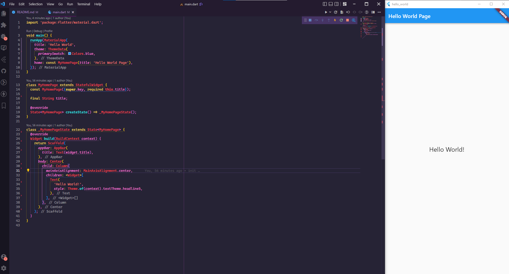
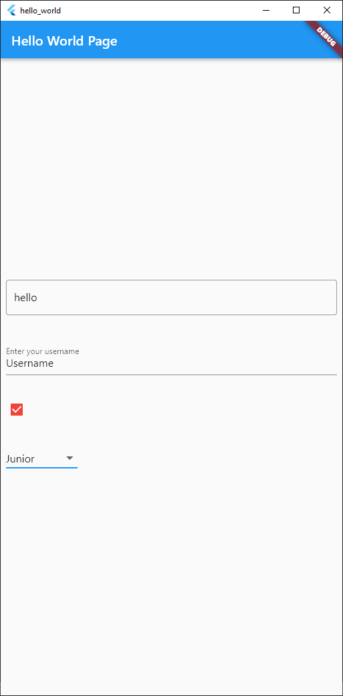
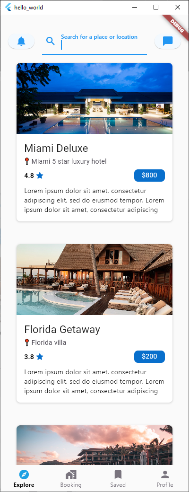
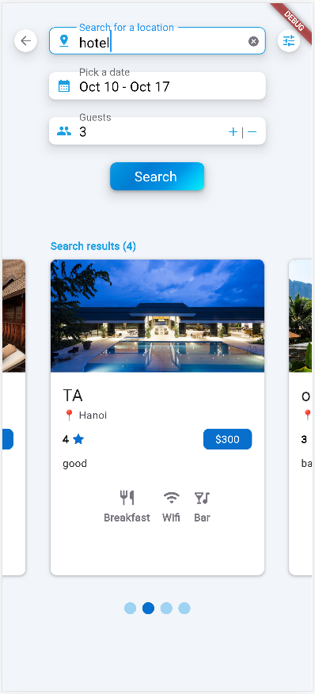
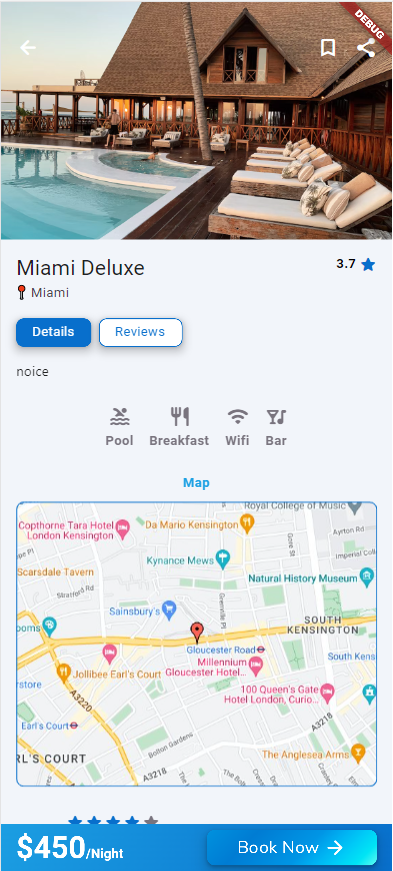
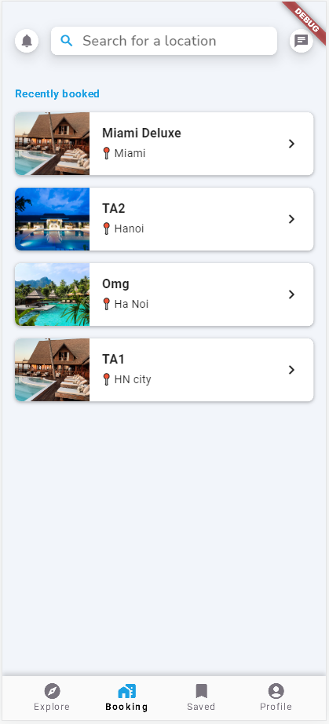
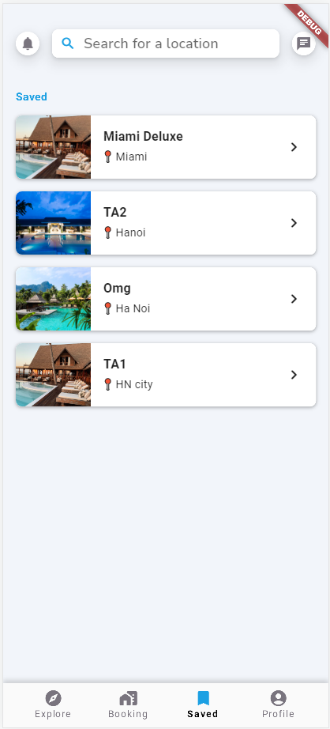
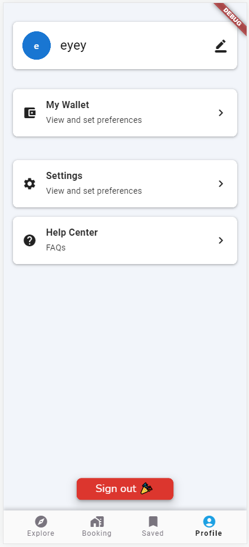
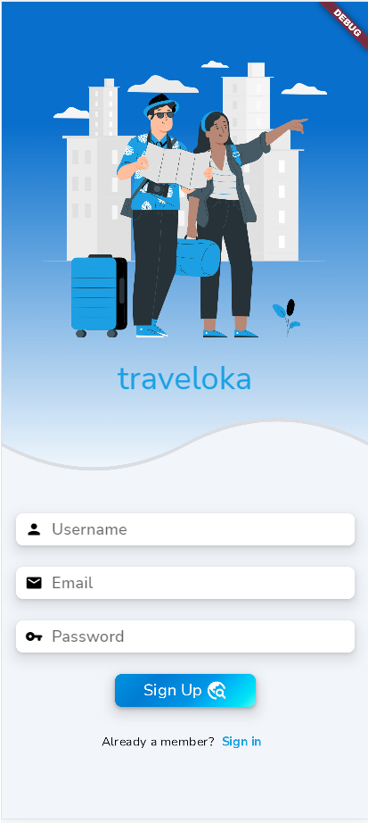
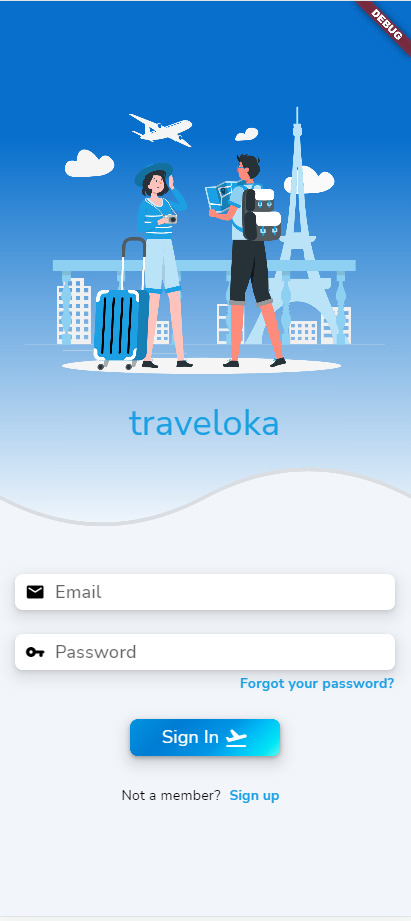

# Group 17 - INT3120 40

## Mobile Development using Flutter

## 1. Team members

-  [Hoang Viet Khanh - 20020296](https://github.com/Kevinking16)
-  [Tran Dinh Gia Khanh - 20020141](https://github.com/Racker-Hank)
-  [Le Tuan Anh - 20021286](https://github.com/A-v-o-c-a-d-o)

## 2. Process

**TOC**:

-  [Week 1: Holiday](#week-1-holiday)
-  [Week 2: Hello World](#week-2-hello-world)
-  [Week 3: Hello World](#week-3-hello-world)
-  [Week 4: Explore Page](#week-4-explore-page)
-  [Week 5](#week-5)
-  [Week 6](#week-6)
-  [Week 7](#week-7)
-  [Week 8: Profile Page](#week-8-profile-page)
-  [Week 9: Auth](#week-9-auth)
-  [Week 10](#week-10)
-  [Week 11](#week-11)

### Week 1: Holiday

### Week 2: Hello World

<!--  -->

### Week 3: Hello World

<!--  -->

### Week 4: Explore Page

<!--  -->

### Week 5:

-  Search Page
-  Create database

<!--  -->

### Week 6:

-  Hotel Page
-  Read from database

<!--  -->

### Week 7:

-  Booking Page
-  Saved Page

    
    

### Week 8: Profile Page

<!--  -->

### Week 9: Auth

-  Sign up
-  Sign in
-  Sign out

    
    

### Week 10:

-  Testing :
   -  [Monkey Test](./traveloka/test/monkey_test_logs.txt)

### Week 11:

-  API used:
   -  Firebase Auth
   -  Firestore
-  App screenshots: see above
